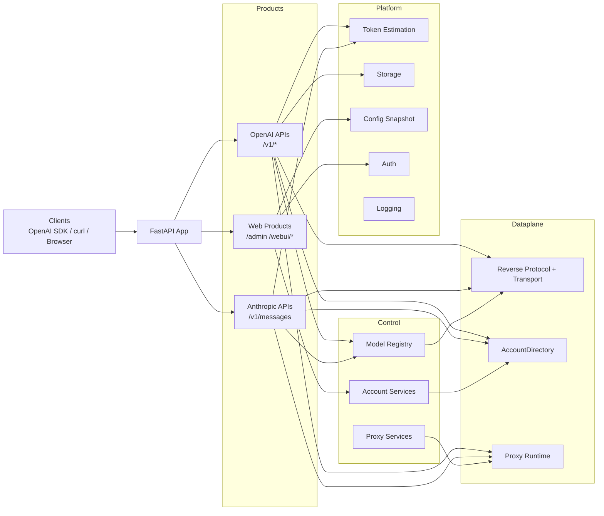

[](https://www.python.org/)
[](https://fastapi.tiangolo.com/)
[](pyproject.toml)
[](LICENSE)
[](docs/README.en.md)
[](https://blog.cheny.me/blog/posts/grok2api)


> [!NOTE]
> 本项目仅供学习与研究交流。请务必遵循 Grok 的使用条款及当地法律法规，不得用于非法用途！二开与 PR 请保留原作者与前端标识。

<br>

Grok2API 是一个基于 **FastAPI** 构建的 Grok 网关，支持将 Grok Web 能力以 OpenAI 兼容 API 的方式转换。核心特性：
- OpenAI 兼容接口：`/v1/models`、`/v1/chat/completions`、`/v1/responses`、`/v1/images/generations`、`/v1/images/edits`、`/v1/videos`、`/v1/videos/{video_id}`、`/v1/videos/{video_id}/content`
- Anthropic 兼容接口：`/v1/messages`
- 支持流式与非流式对话、显式思考输出、函数工具结构透传，以及统一的 token / usage 统计
- 支持多账号池、层级选号、失败反馈、额度同步与自动维护
- 支持本地缓存图片、视频与本地代理链接返回
- 支持文生图、图像编辑、文生视频、图生视频
- 内置 Admin 后台管理、Web Chat、Masonry 生图、ChatKit 语音页面

<br>

## 服务架构



<br>

## 快速开始

### 本地部署

```bash
git clone https://github.com/chenyme/grok2api
cd grok2api
cp .env.example .env
uv sync
uv run granian --interface asgi --host 0.0.0.0 --port 8000 --workers 1 app.main:app
```

### Docker Compose

```bash
git clone https://github.com/chenyme/grok2api
cd grok2api
cp .env.example .env
docker compose up -d
```

### Vercel

[](https://vercel.com/new/clone?repository-url=https://github.com/chenyme/grok2api&env=LOG_LEVEL,LOG_FILE_ENABLED,DATA_DIR,LOG_DIR,ACCOUNT_STORAGE,ACCOUNT_REDIS_URL,ACCOUNT_MYSQL_URL,ACCOUNT_POSTGRESQL_URL)

### Render

[](https://render.com/deploy?repo=https://github.com/chenyme/grok2api)

### 首次启动

1. 修改 `app.app_key`
2. 设置 `app.api_key`
3. 设置 `app.app_url`（否则图片、视频的链接会 403 无权访问）

<br>

## WebUI

### 页面入口

| 页面 | 路径 |
| :-- | :-- |
| Admin 登录页 | `/admin/login` |
| 账号管理 | `/admin/account` |
| 配置管理 | `/admin/config` |
| 缓存管理 | `/admin/cache` |
| WebUI 登录页 | `/webui/login` |
| Web Chat | `/webui/chat` |
| Masonry | `/webui/masonry` |
| ChatKit | `/webui/chatkit` |

### 鉴权规则

| 范围 | 配置项 | 规则 |
| :-- | :-- | :-- |
| `/v1/*` | `app.api_key` | 为空则不额外鉴权 |
| `/admin/*` | `app.app_key` | 默认值 `grok2api` |
| `/webui/*` | `app.webui_enabled`, `app.webui_key` | 默认关闭；`webui_key` 为空则不额外校验 |

<br>

## 配置体系

### 配置分层

| 位置 | 用途 | 生效时机 |
| :-- | :-- | :-- |
| `.env` | 启动前配置 | 服务启动时 |
| `${DATA_DIR}/config.toml` | 运行时配置 | 保存后即时生效 |
| `config.defaults.toml` | 默认模板 | 首次初始化时 |


### 环境变量

| 变量名 | 说明 | 默认值 |
| :-- | :-- | :-- |
| `TZ` | 时区 | `Asia/Shanghai` |
| `LOG_LEVEL` | 日志级别 | `INFO` |
| `LOG_FILE_ENABLED` | 写入本地文件日志 | `true` |
| `ACCOUNT_SYNC_INTERVAL` | 账号目录增量同步间隔（秒） | `30` |
| `SERVER_HOST` | 服务监听地址 | `0.0.0.0` |
| `SERVER_PORT` | 服务监听端口 | `8000` |
| `SERVER_WORKERS` | Granian worker 数量 | `1` |
| `HOST_PORT` | Docker Compose 宿主机映射端口 | `8000` |
| `DATA_DIR` | 本地数据目录 | `./data` |
| `LOG_DIR` | 本地日志目录 | `./logs` |
| `ACCOUNT_STORAGE` | 账号存储后端 | `local` |
| `ACCOUNT_REDIS_URL` | `redis` 模式 Redis DSN | `""` |
| `ACCOUNT_MYSQL_URL` | `mysql` 模式 SQLAlchemy DSN | `""` |
| `ACCOUNT_POSTGRESQL_URL` | `postgresql` 模式 SQLAlchemy DSN | `""` |
| `ACCOUNT_SQL_POOL_SIZE` | SQL 连接池核心连接数 | `5` |
| `ACCOUNT_SQL_MAX_OVERFLOW` | SQL 连接池最大溢出连接数 | `10` |
| `ACCOUNT_SQL_POOL_TIMEOUT` | 等待连接池空闲连接的超时时间（秒） | `30` |
| `ACCOUNT_SQL_POOL_RECYCLE` | 连接最大复用时间（秒），超时后自动重连 | `1800` |

### 系统配置项

| 分组 | 关键项 |
| :-- | :-- |
| `app` | `app_key`, `app_url`, `api_key`, `webui_enabled`, `webui_key` |
| `logging` | `file_level`, `max_files` |
| `features` | `temporary`, `memory`, `stream`, `thinking`, `dynamic_statsig`, `enable_nsfw`, `custom_instruction`, `image_format`, `video_format` |
| `proxy.egress` | `mode`, `proxy_url`, `proxy_pool`, `resource_proxy_url`, `resource_proxy_pool`, `skip_ssl_verify` |
| `proxy.clearance` | `mode`, `cf_cookies`, `user_agent`, `browser`, `flaresolverr_url`, `timeout_sec`, `refresh_interval` |
| `retry` | `reset_session_status_codes`, `max_retries`, `on_codes` |
| `account.refresh` | `basic_interval_sec`, `super_interval_sec`, `heavy_interval_sec`, `usage_concurrency`, `on_demand_min_interval_sec` |
| `chat` | `timeout` |
| `image` | `timeout`, `stream_timeout` |
| `video` | `timeout` |
| `voice` | `timeout` |
| `asset` | `upload_timeout`, `download_timeout`, `list_timeout`, `delete_timeout` |
| `nsfw` | `timeout` |
| `batch` | `nsfw_concurrency`, `refresh_concurrency`, `asset_upload_concurrency`, `asset_list_concurrency`, `asset_delete_concurrency` |

### 图片、视频格式

| 配置项 | 可选值 |
| :-- | :-- |
| `features.image_format` | `grok_url`, `local_url`, `grok_md`, `local_md`, `base64` |
| `features.video_format` | `grok_url`, `local_url`, `grok_html`, `local_html` |

<br>

## 模型支持
> 可通过 `GET /v1/models` 获取当前支持模型列表。

### Chat

| 模型名 | mode | tier |
| :-- | :-- | :-- |
| `grok-4.20-0309-non-reasoning` | `fast` | `basic` |
| `grok-4.20-0309` | `auto` | `basic` |
| `grok-4.20-0309-reasoning` | `expert` | `basic` |
| `grok-4.20-0309-non-reasoning-super` | `fast` | `super` |
| `grok-4.20-0309-super` | `auto` | `super` |
| `grok-4.20-0309-reasoning-super` | `expert` | `super` |
| `grok-4.20-0309-non-reasoning-heavy` | `fast` | `heavy` |
| `grok-4.20-0309-heavy` | `auto` | `heavy` |
| `grok-4.20-0309-reasoning-heavy` | `expert` | `heavy` |
| `grok-4.20-multi-agent-0309` | `heavy` | `heavy` |

### Image

| 模型名 | mode | tier |
| :-- | :-- | :-- |
| `grok-imagine-image-lite` | `fast` | `basic` |
| `grok-imagine-image` | `auto` | `super` |
| `grok-imagine-image-pro` | `auto` | `super` |

### Image Edit

| 模型名 | mode | tier |
| :-- | :-- | :-- |
| `grok-imagine-image-edit` | `auto` | `super` |

### Video

| 模型名 | mode | tier |
| :-- | :-- | :-- |
| `grok-imagine-video` | `auto` | `super` |

<br>

## API 一览

| 接口 | 是否鉴权 | 说明 |
| :-- | :-- | :-- |
| `GET /v1/models` | 是 | 列出当前启用模型 |
| `GET /v1/models/{model_id}` | 是 | 获取单个模型信息 |
| `POST /v1/chat/completions` | 是 | 对话 / 图像 / 视频统一入口 |
| `POST /v1/responses` | 是 | OpenAI Responses API 兼容子集 |
| `POST /v1/messages` | 是 | Anthropic Messages API 兼容接口 |
| `POST /v1/images/generations` | 是 | 独立图像生成接口 |
| `POST /v1/images/edits` | 是 | 独立图像编辑接口 |
| `POST /v1/videos` | 是 | 异步视频任务创建 |
| `GET /v1/videos/{video_id}` | 是 | 查询视频任务 |
| `GET /v1/videos/{video_id}/content` | 是 | 获取最终视频文件 |
| `GET /v1/files/image?id=...` | 否 | 获取本地缓存图片 |
| `GET /v1/files/video?id=...` | 否 | 获取本地缓存视频 |

<br>

## 接口示例

> 以下示例默认使用 `http://localhost:8000` 地址。

<details>
<summary><code>GET /v1/models</code></summary>
<br>

```bash
curl http://localhost:8000/v1/models \
  -H "Authorization: Bearer $GROK2API_API_KEY"
```

<br>
</details>

<details>
<summary><code>POST /v1/chat/completions</code></summary>
<br>

对话：

```bash
curl http://localhost:8000/v1/chat/completions \
  -H "Content-Type: application/json" \
  -H "Authorization: Bearer $GROK2API_API_KEY" \
  -d '{
    "model": "grok-4.20-0309",
    "stream": true,
    "messages": [
      {"role":"user","content":"你好"}
    ]
  }'
```

图像：

```bash
curl http://localhost:8000/v1/chat/completions \
  -H "Content-Type: application/json" \
  -H "Authorization: Bearer $GROK2API_API_KEY" \
  -d '{
    "model": "grok-imagine-image",
    "stream": true,
    "messages": [
      {"role":"user","content":"一只在太空漂浮的猫"}
    ],
    "image_config": {
      "n": 2,
      "size": "1024x1024",
      "response_format": "url"
    }
  }'
```

视频：

```bash
curl http://localhost:8000/v1/chat/completions \
  -H "Content-Type: application/json" \
  -H "Authorization: Bearer $GROK2API_API_KEY" \
  -d '{
    "model": "grok-imagine-video",
    "stream": true,
    "messages": [
      {"role":"user","content":"霓虹雨夜街头，电影感慢镜头追拍"}
    ],
    "video_config": {
      "seconds": 10,
      "size": "1792x1024",
      "resolution_name": "720p",
      "preset": "normal"
    }
  }'
```

关键字段：

| 字段 | 说明 |
| :-- | :-- |
| `messages` | 支持文本与多模态内容块 |
| `thinking` | 是否显式输出思考过程 |
| `reasoning_effort` | `none`, `minimal`, `low`, `medium`, `high`, `xhigh` |
| `tools` | OpenAI function tools 结构 |
| `image_config.n` | `lite` 为 `1-4`，其他图像模型为 `1-10`，编辑模型为 `1-2` |
| `image_config.size` | `1280x720`, `720x1280`, `1792x1024`, `1024x1792`, `1024x1024` |
| `video_config.seconds` | `6`, `10`, `12`, `16`, `20` |
| `video_config.size` | `720x1280`, `1280x720`, `1024x1024`, `1024x1792`, `1792x1024` |
| `video_config.resolution_name` | `480p`, `720p` |
| `video_config.preset` | `fun`, `normal`, `spicy`, `custom` |

<br>
</details>

<details>
<summary><code>POST /v1/responses</code></summary>
<br>

```bash
curl http://localhost:8000/v1/responses \
  -H "Content-Type: application/json" \
  -H "Authorization: Bearer $GROK2API_API_KEY" \
  -d '{
    "model": "grok-4.20-0309",
    "input": "解释一下量子隧穿",
    "stream": true
  }'
```

<br>
</details>

<details>
<summary><code>POST /v1/messages</code></summary>
<br>

```bash
curl http://localhost:8000/v1/messages \
  -H "Content-Type: application/json" \
  -H "Authorization: Bearer $GROK2API_API_KEY" \
  -d '{
    "model": "grok-4.20-0309",
    "stream": true,
    "messages": [
      {
        "role": "user",
        "content": "用三句话解释量子隧穿"
      }
    ]
  }'
```

<br>
</details>

<details>
<summary><code>POST /v1/images/generations</code></summary>
<br>

```bash
curl http://localhost:8000/v1/images/generations \
  -H "Content-Type: application/json" \
  -H "Authorization: Bearer $GROK2API_API_KEY" \
  -d '{
    "model": "grok-imagine-image",
    "prompt": "一只在太空漂浮的猫",
    "n": 1,
    "size": "1024x1024",
    "response_format": "url"
  }'
```

<br>
</details>

<details>
<summary><code>POST /v1/images/edits</code></summary>
<br>

```bash
curl http://localhost:8000/v1/images/edits \
  -H "Authorization: Bearer $GROK2API_API_KEY" \
  -F "model=grok-imagine-image-edit" \
  -F "prompt=把这张图变清晰一些" \
  -F "image[]=@/path/to/image.png" \
  -F "n=1" \
  -F "size=1024x1024" \
  -F "response_format=url"
```

<br>
</details>

<details>
<summary><code>POST /v1/videos</code></summary>
<br>

```bash
curl http://localhost:8000/v1/videos \
  -H "Authorization: Bearer $GROK2API_API_KEY" \
  -F "model=grok-imagine-video" \
  -F "prompt=霓虹雨夜街头，电影感慢镜头追拍" \
  -F "seconds=10" \
  -F "size=1792x1024" \
  -F "resolution_name=720p" \
  -F "preset=normal"
```

```bash
curl http://localhost:8000/v1/videos/<video_id> \
  -H "Authorization: Bearer $GROK2API_API_KEY"

curl -L http://localhost:8000/v1/videos/<video_id>/content \
  -H "Authorization: Bearer $GROK2API_API_KEY" \
  -o result.mp4
```

<br>
</details>

<br>

## Star History

[](https://star-history.com/#Chenyme/grok2api&Timeline)
