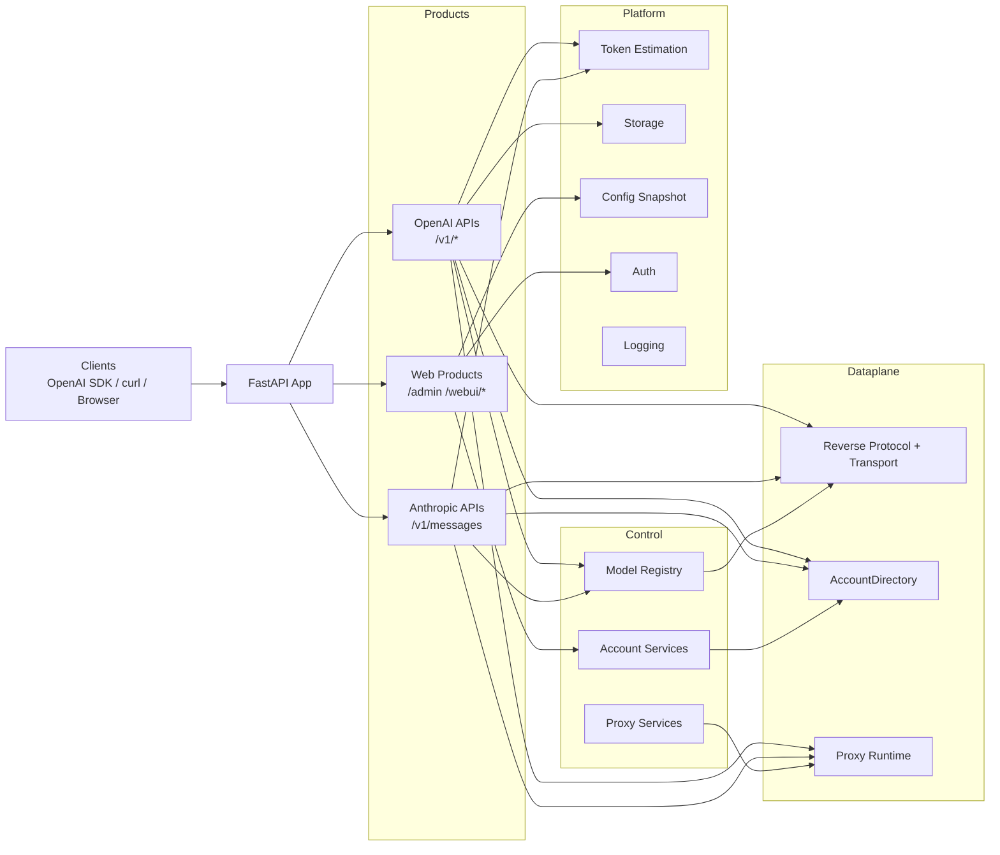

[](https://www.python.org/)
[](https://fastapi.tiangolo.com/)
[](../pyproject.toml)
[](../LICENSE)
[](../README.md)
[](https://blog.cheny.me/blog/posts/grok2api)

> [!NOTE]
> This project is for learning and research only. Please comply with Grok's terms of use and all applicable local laws and regulations. Do not use it for illegal purposes. If you fork the project or open a PR, please keep the original author and frontend attribution.

<br>

Grok2API is a **FastAPI**-based Grok gateway that exposes Grok Web capabilities through OpenAI-compatible APIs. Core features:
- OpenAI-compatible endpoints: `/v1/models`, `/v1/chat/completions`, `/v1/responses`, `/v1/images/generations`, `/v1/images/edits`, `/v1/videos`, `/v1/videos/{video_id}`, `/v1/videos/{video_id}/content`
- Anthropic-compatible endpoint: `/v1/messages`
- Streaming and non-streaming chat, explicit reasoning output, function-tool structure passthrough, and unified token / usage accounting
- Multi-account pools, tier-aware selection, failure feedback, quota synchronization, and automatic maintenance
- Local image/video caching and locally proxied media URLs
- Text-to-image, image editing, text-to-video, and image-to-video support
- Built-in Admin dashboard, Web Chat, Masonry image generation, and ChatKit voice page

<br>

## Service Architecture



<br>

## Quick Start

### Local Deployment

```bash
git clone https://github.com/chenyme/grok2api
cd grok2api
cp .env.example .env
uv sync
uv run granian --interface asgi --host 0.0.0.0 --port 8000 --workers 1 app.main:app
```

### Docker Compose

```bash
git clone https://github.com/chenyme/grok2api
cd grok2api
cp .env.example .env
docker compose up -d
```

### Vercel

[](https://vercel.com/new/clone?repository-url=https://github.com/chenyme/grok2api&env=LOG_LEVEL,LOG_FILE_ENABLED,DATA_DIR,LOG_DIR,ACCOUNT_STORAGE,ACCOUNT_REDIS_URL,ACCOUNT_MYSQL_URL,ACCOUNT_POSTGRESQL_URL)

### Render

[](https://render.com/deploy?repo=https://github.com/chenyme/grok2api)

### First Launch

1. Change `app.app_key`
2. Set `app.api_key`
3. Set `app.app_url` otherwise image and video URLs may return `403 Forbidden`

<br>

## WebUI

### Routes

| Page | Path |
| :-- | :-- |
| Admin login | `/admin/login` |
| Account management | `/admin/account` |
| Config management | `/admin/config` |
| Cache management | `/admin/cache` |
| WebUI login | `/webui/login` |
| Web Chat | `/webui/chat` |
| Masonry | `/webui/masonry` |
| ChatKit | `/webui/chatkit` |

### Authentication Rules

| Scope | Config | Rule |
| :-- | :-- | :-- |
| `/v1/*` | `app.api_key` | No extra authentication when empty |
| `/admin/*` | `app.app_key` | Default value: `grok2api` |
| `/webui/*` | `app.webui_enabled`, `app.webui_key` | Disabled by default; if `webui_key` is empty, no extra verification is required |

<br>

## Configuration

### Configuration Layers

| Location | Purpose | Effective Time |
| :-- | :-- | :-- |
| `.env` | Pre-start configuration | At service startup |
| `${DATA_DIR}/config.toml` | Runtime configuration | Effective immediately after save |
| `config.defaults.toml` | Default template | On first initialization |


### Environment Variables

| Variable | Description | Default |
| :-- | :-- | :-- |
| `TZ` | Time zone | `Asia/Shanghai` |
| `LOG_LEVEL` | Log level | `INFO` |
| `LOG_FILE_ENABLED` | Write local log files | `true` |
| `ACCOUNT_SYNC_INTERVAL` | Account directory incremental sync interval in seconds | `30` |
| `SERVER_HOST` | Service bind address | `0.0.0.0` |
| `SERVER_PORT` | Service port | `8000` |
| `SERVER_WORKERS` | Granian worker count | `1` |
| `HOST_PORT` | Docker Compose published host port | `8000` |
| `DATA_DIR` | Local data directory | `./data` |
| `LOG_DIR` | Local log directory | `./logs` |
| `ACCOUNT_STORAGE` | Account storage backend | `local` |
| `ACCOUNT_REDIS_URL` | Redis DSN for `redis` mode | `""` |
| `ACCOUNT_MYSQL_URL` | SQLAlchemy DSN for `mysql` mode | `""` |
| `ACCOUNT_POSTGRESQL_URL` | SQLAlchemy DSN for `postgresql` mode | `""` |
| `ACCOUNT_SQL_POOL_SIZE` | Core connection pool size for SQL backends | `5` |
| `ACCOUNT_SQL_MAX_OVERFLOW` | Maximum overflow connections above pool size | `10` |
| `ACCOUNT_SQL_POOL_TIMEOUT` | Seconds to wait for a free connection from the pool | `30` |
| `ACCOUNT_SQL_POOL_RECYCLE` | Max connection lifetime in seconds before reconnect | `1800` |

### System Configuration Groups

| Group | Key Items |
| :-- | :-- |
| `app` | `app_key`, `app_url`, `api_key`, `webui_enabled`, `webui_key` |
| `features` | `temporary`, `memory`, `stream`, `thinking`, `dynamic_statsig`, `enable_nsfw`, `custom_instruction`, `image_format`, `video_format` |
| `proxy.egress` | `mode`, `proxy_url`, `proxy_pool`, `resource_proxy_url`, `resource_proxy_pool`, `skip_ssl_verify` |
| `proxy.clearance` | `mode`, `cf_cookies`, `user_agent`, `browser`, `flaresolverr_url`, `timeout_sec`, `refresh_interval` |
| `retry` | `reset_session_status_codes`, `max_retries`, `on_codes` |
| `account.refresh` | `basic_interval_sec`, `super_interval_sec`, `heavy_interval_sec`, `usage_concurrency`, `on_demand_min_interval_sec` |
| `chat` | `timeout` |
| `image` | `timeout`, `stream_timeout` |
| `video` | `timeout` |
| `voice` | `timeout` |
| `asset` | `upload_timeout`, `download_timeout`, `list_timeout`, `delete_timeout` |
| `nsfw` | `timeout` |
| `batch` | `nsfw_concurrency`, `refresh_concurrency`, `asset_upload_concurrency`, `asset_list_concurrency`, `asset_delete_concurrency` |

### Image and Video Formats

| Config | Allowed Values |
| :-- | :-- |
| `features.image_format` | `grok_url`, `local_url`, `grok_md`, `local_md`, `base64` |
| `features.video_format` | `grok_url`, `local_url`, `grok_html`, `local_html` |

<br>

## Supported Models
> You can use `GET /v1/models` to retrieve the currently supported model list.

### Chat

| Model | mode | tier |
| :-- | :-- | :-- |
| `grok-4.20-0309-non-reasoning` | `fast` | `basic` |
| `grok-4.20-0309` | `auto` | `basic` |
| `grok-4.20-0309-reasoning` | `expert` | `basic` |
| `grok-4.20-0309-non-reasoning-super` | `fast` | `super` |
| `grok-4.20-0309-super` | `auto` | `super` |
| `grok-4.20-0309-reasoning-super` | `expert` | `super` |
| `grok-4.20-0309-non-reasoning-heavy` | `fast` | `heavy` |
| `grok-4.20-0309-heavy` | `auto` | `heavy` |
| `grok-4.20-0309-reasoning-heavy` | `expert` | `heavy` |
| `grok-4.20-multi-agent-0309` | `heavy` | `heavy` |

### Image

| Model | mode | tier |
| :-- | :-- | :-- |
| `grok-imagine-image-lite` | `fast` | `basic` |
| `grok-imagine-image` | `auto` | `super` |
| `grok-imagine-image-pro` | `auto` | `super` |

### Image Edit

| Model | mode | tier |
| :-- | :-- | :-- |
| `grok-imagine-image-edit` | `auto` | `super` |

### Video

| Model | mode | tier |
| :-- | :-- | :-- |
| `grok-imagine-video` | `auto` | `super` |

<br>

## API Overview

| Endpoint | Auth Required | Description |
| :-- | :-- | :-- |
| `GET /v1/models` | Yes | List currently enabled models |
| `GET /v1/models/{model_id}` | Yes | Retrieve one model |
| `POST /v1/chat/completions` | Yes | Unified entry point for chat, image, and video |
| `POST /v1/responses` | Yes | OpenAI Responses API compatible subset |
| `POST /v1/messages` | Yes | Anthropic Messages API compatible endpoint |
| `POST /v1/images/generations` | Yes | Standalone image generation endpoint |
| `POST /v1/images/edits` | Yes | Standalone image editing endpoint |
| `POST /v1/videos` | Yes | Asynchronous video job creation |
| `GET /v1/videos/{video_id}` | Yes | Retrieve a video job |
| `GET /v1/videos/{video_id}/content` | Yes | Fetch the final video file |
| `GET /v1/files/image?id=...` | No | Fetch a locally cached image |
| `GET /v1/files/video?id=...` | No | Fetch a locally cached video |

<br>

## API Examples

> The examples below use `http://localhost:8000`.

<details>
<summary><code>GET /v1/models</code></summary>
<br>

```bash
curl http://localhost:8000/v1/models \
  -H "Authorization: Bearer $GROK2API_API_KEY"
```

<br>
</details>

<details>
<summary><code>POST /v1/chat/completions</code></summary>
<br>

Chat:

```bash
curl http://localhost:8000/v1/chat/completions \
  -H "Content-Type: application/json" \
  -H "Authorization: Bearer $GROK2API_API_KEY" \
  -d '{
    "model": "grok-4.20-0309",
    "stream": true,
    "messages": [
      {"role":"user","content":"Hello"}
    ]
  }'
```

Image:

```bash
curl http://localhost:8000/v1/chat/completions \
  -H "Content-Type: application/json" \
  -H "Authorization: Bearer $GROK2API_API_KEY" \
  -d '{
    "model": "grok-imagine-image",
    "stream": true,
    "messages": [
      {"role":"user","content":"A cat floating in space"}
    ],
    "image_config": {
      "n": 2,
      "size": "1024x1024",
      "response_format": "url"
    }
  }'
```

Video:

```bash
curl http://localhost:8000/v1/chat/completions \
  -H "Content-Type: application/json" \
  -H "Authorization: Bearer $GROK2API_API_KEY" \
  -d '{
    "model": "grok-imagine-video",
    "stream": true,
    "messages": [
      {"role":"user","content":"A neon rainy street at night, cinematic slow tracking shot"}
    ],
    "video_config": {
      "seconds": 10,
      "size": "1792x1024",
      "resolution_name": "720p",
      "preset": "normal"
    }
  }'
```

Key fields:

| Field | Description |
| :-- | :-- |
| `messages` | Supports text and multimodal content blocks |
| `thinking` | Whether to explicitly emit reasoning output |
| `reasoning_effort` | `none`, `minimal`, `low`, `medium`, `high`, `xhigh` |
| `tools` | OpenAI function tools structure |
| `image_config.n` | `1-4` for `lite`, `1-10` for other image models, `1-2` for edit |
| `image_config.size` | `1280x720`, `720x1280`, `1792x1024`, `1024x1792`, `1024x1024` |
| `video_config.seconds` | `6`, `10`, `12`, `16`, `20` |
| `video_config.size` | `720x1280`, `1280x720`, `1024x1024`, `1024x1792`, `1792x1024` |
| `video_config.resolution_name` | `480p`, `720p` |
| `video_config.preset` | `fun`, `normal`, `spicy`, `custom` |

<br>
</details>

<details>
<summary><code>POST /v1/responses</code></summary>
<br>

```bash
curl http://localhost:8000/v1/responses \
  -H "Content-Type: application/json" \
  -H "Authorization: Bearer $GROK2API_API_KEY" \
  -d '{
    "model": "grok-4.20-0309",
    "input": "Explain quantum tunneling",
    "stream": true
  }'
```

<br>
</details>

<details>
<summary><code>POST /v1/messages</code></summary>
<br>

```bash
curl http://localhost:8000/v1/messages \
  -H "Content-Type: application/json" \
  -H "Authorization: Bearer $GROK2API_API_KEY" \
  -d '{
    "model": "grok-4.20-0309",
    "stream": true,
    "messages": [
      {
        "role": "user",
        "content": "Explain quantum tunneling in three sentences"
      }
    ]
  }'
```

<br>
</details>

<details>
<summary><code>POST /v1/images/generations</code></summary>
<br>

```bash
curl http://localhost:8000/v1/images/generations \
  -H "Content-Type: application/json" \
  -H "Authorization: Bearer $GROK2API_API_KEY" \
  -d '{
    "model": "grok-imagine-image",
    "prompt": "A cat floating in space",
    "n": 1,
    "size": "1024x1024",
    "response_format": "url"
  }'
```

<br>
</details>

<details>
<summary><code>POST /v1/images/edits</code></summary>
<br>

```bash
curl http://localhost:8000/v1/images/edits \
  -H "Authorization: Bearer $GROK2API_API_KEY" \
  -F "model=grok-imagine-image-edit" \
  -F "prompt=Make this image sharper" \
  -F "image[]=@/path/to/image.png" \
  -F "n=1" \
  -F "size=1024x1024" \
  -F "response_format=url"
```

<br>
</details>

<details>
<summary><code>POST /v1/videos</code></summary>
<br>

```bash
curl http://localhost:8000/v1/videos \
  -H "Authorization: Bearer $GROK2API_API_KEY" \
  -F "model=grok-imagine-video" \
  -F "prompt=A neon rainy street at night, cinematic slow tracking shot" \
  -F "seconds=10" \
  -F "size=1792x1024" \
  -F "resolution_name=720p" \
  -F "preset=normal"
```

```bash
curl http://localhost:8000/v1/videos/<video_id> \
  -H "Authorization: Bearer $GROK2API_API_KEY"

curl -L http://localhost:8000/v1/videos/<video_id>/content \
  -H "Authorization: Bearer $GROK2API_API_KEY" \
  -o result.mp4
```

<br>
</details>

<br>

## Star History

[](https://star-history.com/#Chenyme/grok2api&Timeline)
